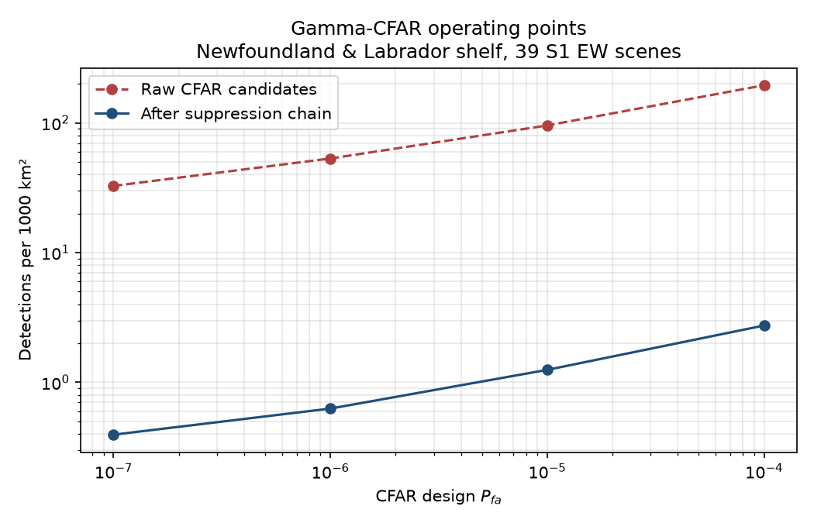

# Detection Benchmark

**Detector:** Gamma-CFAR · **Region:** Newfoundland & Labrador shelf  
**Scenes:** 39 Sentinel-1 EW GRDM acquisitions · **Analysed water:** 4,609,212 km²

---

## Headline

| Metric | Value |
|---|---:|
| Raw CFAR candidates per 1000 km² | 58.40 |
| **After suppression, per 1000 km²** | **1.27** |
| Suppression factor | 45.9× |
| Total detections retained | 5,864 |
| Total raw candidates | 269,155 |

### What this number is

**Detection density per 1000 km² of analysed water.** Over open water away
from land and ice, genuine icebergs are sparse at Sentinel-1 EW resolution,
so this figure is dominated by false alarms and is reported as an **upper
bound on the false-alarm rate**.

It is **not** precision, recall, or mAP. No verified iceberg positions exist
for these scenes — see [LIMITATIONS.md](LIMITATIONS.md) §1. Every rate is
normalised by the water area actually examined after masking, because false
alarms *per scene* is meaningless when swath coverage and land fraction differ
between acquisitions.

---

## Stratified results

### By sea ice regime

| stratum | scenes | water area (km²) | detections | per 1000 km² | suppression |
|---|---:|---:|---:|---:|---:|
| ice_affected | 30 | 3,409,999 | 5,219 | 1.53 | 45.0× |
| open_water | 6 | 862,502 | 223 | 0.26 | 110.6× |
| unknown | 3 | 336,711 | 422 | 1.25 | 23.1× |

`unknown` covers the AI4Arctic challenge test scenes, whose ice charts are
withheld. They are reported separately rather than folded into open water,
which would understate detection density over ice.

### By relative wind regime

| stratum | scenes | water area (km²) | detections | per 1000 km² | suppression |
|---|---:|---:|---:|---:|---:|
| high | 13 | 1,655,693 | 2,172 | 1.31 | 52.9× |
| low | 13 | 1,543,141 | 1,763 | 1.14 | 46.8× |
| moderate | 13 | 1,410,378 | 1,929 | 1.37 | 37.1× |

Wind bins are **terciles across this scene cohort**, not absolute m/s, and
not within-scene quantiles. The ERA5 fields in this distribution are
standardised with no recorded extremes, so metres per second is
unrecoverable (LIMITATIONS §3); the per-scene median still orders scenes
correctly, so the split is between scenes rather than inside one.
`unknown` marks scenes carrying no wind field, which are excluded from the
tercile fit.

---

## Suppression ledger

Where the candidate budget went, summed across every scene:

| stage | removed | remaining | % of raw |
|---|---:|---:|---:|
| `min_size` | 261,468 | 7,687 | 97.1% |
| `max_size` | 0 | 7,687 | 0.0% |
| `aspect_ratio` | 3 | 7,684 | 0.0% |
| `min_peak_hv` | 642 | 7,042 | 0.2% |
| `copol_dominance` | 1,096 | 5,946 | 0.4% |
| `clutter_contrast` | 82 | 5,864 | 0.0% |

This ledger is published rather than summarised because it shows something a
single aggregate figure would hide: **one stage does most of the work.**
CFAR at this Pfa produces predominantly isolated single-pixel speckle hits,
while genuine targets form multi-pixel clusters, so the minimum-size gate
carries the bulk of the suppression.

The recall cost of that threshold is **not measured**. Raising it removes
false alarms and small icebergs together, and without ground truth the
trade-off cannot be located (LIMITATIONS §9).

---

## Operating points

Detection density against the CFAR design false-alarm probability, before
and after the suppression chain. Published so the chosen operating point
can be read off a curve rather than taken on trust.

| Pfa | raw per 1000 km² | after suppression | scenes |
|---|---:|---:|---:|
| 1e-07 | 32.67 | 0.40 | 5 |
| 1e-06 | 53.15 | 0.63 | 5 |
| 1e-05 | 95.55 | 1.25 | 5 |
| 1e-04 | 194.91 | 2.74 | 5 |

The sweep runs on a 5-scene subset rather than the full 39, because each additional Pfa multiplies the compute by a whole pass over the cohort. Absolute densities here are therefore **not** directly comparable with the headline figure above; the curve's shape and the ratio between operating points are what it is published for.



---

## Two detectors, one harness

Cell-averaging and Gamma/K-distribution CFAR run over the same 12-scene subset (1,487,588 km²), same suppression chain, same Pfa:

| Detector | raw per 1000 km² | after suppression | detections | suppression |
|---|---:|---:|---:|---:|
| CA-CFAR | 2.69 | 0.179 | 267 | 15.0× |
| Gamma-CFAR | 80.73 | 1.469 | 2,186 | 54.9× |

**This table does not say which detector is better, and it cannot.**

CA-CFAR retains far fewer targets. That is the expected consequence of
its clutter model: the cell-averaging estimator sets its threshold from
the local *mean*, and over sea ice the mean is inflated by the same
heavy tail the detector is trying to separate from, so the threshold
rises and genuine targets fall below it. The Gamma detector estimates a
shape parameter by method of moments and adapts to that tail, which is
precisely why ADR-008 specifies it for sea states at or above 3.

Whether CA-CFAR's lower density represents *fewer false alarms* or
*fewer detections of real targets* is not determinable from these
numbers. Separating the two requires verified positives, which do not
exist for these scenes (LIMITATIONS §1). Reporting the comparison as a
win for either detector would be reading a result the data does not
support.

---

## Reproducing

```bash
make fetch-shorelines   # GSHHG coastlines for land masking
make scene-index        # index the AI4Arctic archive by extent
make benchmark SWEEP=1  # run and write artefacts
python scripts/make_benchmark_doc.py
```

Scene selection requires the scene **centre** inside the AOI
(64.5°W–44.0°W, 42.5°N–60.5°N), not merely an overlap: an EW swath is about
400 km across and can clip the corner of the box while lying almost entirely
outside the region.

## Per-scene results

| scene | ice regime | wind | water km² | raw | kept | per 1000 km² |
|---|---|---|---:|---:|---:|---:|
| `20190406T102029_cis` | unknown | moderate | 41,860 | 1,136 | 62 | 1.48 |
| `20200217T102731_cis` | unknown | high | 143,403 | 3,792 | 167 | 1.17 |
| `20200319T101935_cis` | unknown | high | 151,448 | 4,810 | 193 | 1.27 |
| `20180331T212355_cis` | ice_affected | high | 181,428 | 33,722 | 59 | 0.33 |
| `20180410T214024_cis` | ice_affected | moderate | 104,384 | 16,024 | 296 | 2.84 |
| `20180428T093937_cis` | open_water | low | 161,343 | 4,154 | 125 | 0.78 |
| `20180619T104303_cis` | ice_affected | low | 113,067 | 6,060 | 130 | 1.15 |
| `20180621T214028_cis` | ice_affected | low | 106,655 | 17,517 | 398 | 3.73 |
| `20190206T212401_cis` | ice_affected | high | 167,516 | 11,092 | 31 | 0.18 |
| `20190216T214030_cis` | ice_affected | moderate | 103,792 | 12,734 | 461 | 4.44 |
| `20190306T102725_cis` | ice_affected | high | 143,793 | 6,513 | 206 | 1.43 |
| `20190308T101217_cis` | ice_affected | high | 68,899 | 2,540 | 58 | 0.84 |
| `20190326T212401_cis` | ice_affected | moderate | 168,050 | 8,910 | 109 | 0.65 |
| `20190401T101117_cis` | ice_affected | moderate | 157,059 | 6,732 | 368 | 2.34 |
| `20190405T214031_cis` | ice_affected | high | 106,766 | 10,924 | 255 | 2.39 |
| `20190411T102726_cis` | ice_affected | high | 145,153 | 4,646 | 128 | 0.88 |
| `20190507T101118_cis` | open_water | low | 157,526 | 3,010 | 48 | 0.30 |
| `20190507T101218_cis` | ice_affected | low | 69,065 | 2,384 | 142 | 2.06 |
| `20190524T101931_cis` | ice_affected | low | 149,922 | 3,193 | 28 | 0.19 |
| `20190612T101120_cis` | open_water | moderate | 156,809 | 3,377 | 29 | 0.18 |
| `20190612T101220_cis` | ice_affected | moderate | 68,654 | 2,395 | 167 | 2.43 |
| `20200201T212408_cis` | ice_affected | low | 167,683 | 23,222 | 377 | 2.25 |
| `20200203T104354_cis` | ice_affected | moderate | 114,597 | 1,404 | 61 | 0.53 |
| `20200224T102034_cis` | ice_affected | low | 37,633 | 718 | 47 | 1.25 |
| `20200306T214036_cis` | ice_affected | high | 106,713 | 5,873 | 95 | 0.89 |
| `20200319T102035_cis` | ice_affected | high | 37,625 | 1,425 | 55 | 1.46 |
| `20200413T212408_cis` | open_water | moderate | 167,985 | 10,118 | 7 | 0.04 |
| `20200415T104354_cis` | ice_affected | moderate | 108,247 | 3,028 | 180 | 1.66 |
| `20200423T214037_cis` | ice_affected | high | 109,822 | 20,703 | 511 | 4.65 |
| `20200424T101936_cis` | ice_affected | high | 150,369 | 4,703 | 140 | 0.93 |
| `20200424T102036_cis` | ice_affected | moderate | 37,626 | 1,498 | 90 | 2.39 |
| `20200506T101936_cis` | ice_affected | low | 148,877 | 3,399 | 69 | 0.46 |
| `20200506T102036_cis` | ice_affected | moderate | 37,617 | 1,440 | 93 | 2.47 |
| `20200517T214039_cis` | ice_affected | low | 102,360 | 744 | 5 | 0.05 |
| `20200523T102734_cis` | ice_affected | high | 142,759 | 4,241 | 274 | 1.92 |
| `20200610T214040_cis` | ice_affected | low | 104,028 | 13,397 | 266 | 2.56 |
| `20200624T212516_cis` | open_water | low | 75,141 | 1,196 | 8 | 0.11 |
| `20210407T101941_cis` | ice_affected | low | 149,841 | 3,581 | 120 | 0.80 |
| `20210530T102740_cis` | open_water | moderate | 143,697 | 2,800 | 6 | 0.04 |
