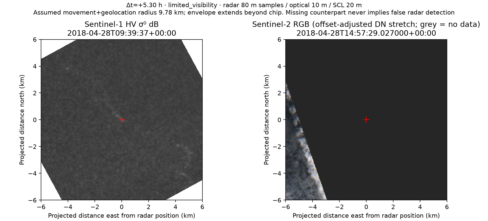

# CDSE Sentinel-2 alternative provider and verification

Implemented locally on 2026-10-05; receipts use UTC 2026-10-06. Planetary Computer
remains the default. CDSE is an explicitly selectable second provider for the
same NL marine study polygon, original SAFE downloads and direct verification.
This does not establish iceberg identity, precision, recall or false alarms.

## Real downloads and integrity

Existing local CDSE credentials authenticated successfully. Two real S2B L2A
products from 2018-04-28 14:57:29.027 UTC were downloaded:

| Tile | CDSE UUID | Delivered ZIP bytes | Catalogue MD5 |
|---|---|---:|---|
| 21UYT | b84aee26-fde4-47f9-a376-33d52ec2a14c | 150,011,773 | 926cb5abbce6ed3d6ffcd5a1b3236bae |
| 22UCC | 72992850-4572-4415-93a8-bfda0f33463e | 71,211,558 | 107a442a37ea98be126bcab42961d91a |

Both archives match their catalogue byte lengths and MD5, pass ZIP CRC checks,
and pass **all 86 referenced SAFE manifest file checks each**, using the
publisher's SHA3-256 checksums. Product XML identity, baseline, acquisition and
required native bands are checked. The catalogue additionally advertises
**BLAKE3, which is explicitly recorded as unchecked**; no BLAKE3 verification is
claimed. Local SHA256 binds the delivered archive and crops to each receipt.

[First product verification](verification-21UYT.json) and
[second product verification](verification-22UCC.json) preserve individual file
checks. Raw ZIPs, JP2s and TIFFs remain in ignored local data directories. Public
catalogue/query receipts contain no credentials or expiring access signatures.

## Same acquisition, different processing

The existing Planetary Computer example identifies:

```text
S2B_MSIL2A_20180428T145729_N0212_R082_T21UYT_20201013T035446.SAFE
```

CDSE has no online exact-name match. The alternative selected product is:

```text
S2B_MSIL2A_20180428T145729_N0500_R082_T21UYT_20230705T144556.SAFE
```

Platform, sensing time, relative orbit and tile match. Baseline and generation
differ. The result is `same_acquisition_reprocessed`, with
`exact_product_equivalence_established: false`. Exact online products are
preferred when available; a different platform, orbit, time or tile is refused.
The [comparison receipt](comparison.json) records both searches and the hosted
original metadata source/hash independently of the CDSE checks.

Native CRS, pixel grids and crop shapes match without comparison resampling.
Each RGB/NIR band has **587,566 jointly valid pixels**; SCL has **146,920**.
Raw DN values are not comparable across these processing baselines. Original
product XML declares quantification 10,000 in both and BOA offsets 0 for the
older baseline versus −1,000 DN for 05.00. After applying those declarations:

| Band | Mean absolute BOA reflectance difference |
|---|---:|
| B02 | 0.011675 |
| B03 | 0.007723 |
| B04 | 0.005161 |
| B08 | 0.003820 |

SCL class agreement is **94.66% on jointly valid pixels**. Declared pixel-validity
agreement is about **98.61% over the native crop**, counting both valid and
invalid agreement. Hosted raster masks alone treat many zero-DN pixels as valid;
the comparison therefore reports source-mask agreement separately and excludes
original XML nodata/saturation declarations (SCL 0/1) before physical comparison.
Neither validity agreement nor reflectance difference is a target accuracy score.
These measurements cover one selected tile/crop, not provider-wide equivalence.

CDSE reprocessing and the DN offset change are documented by the official
[L2A baseline description](https://documentation.dataspace.copernicus.eu/Data/Others/Sentinel2_L2A_baseline.html)
and [S2 L2A encoding documentation](https://documentation.dataspace.copernicus.eu/APIs/SentinelHub/Data/S2L2A.html).

## Paired review and measured pilot

The bounded pilot selects one previously reviewed development candidate at
52.058636°N, 53.644867°W. Both matching CDSE tiles downloaded with no asset
failures or selection truncation. **1/1 has downloaded optical context; 0/1
passes useful-visibility screening.** These are selected-pilot counts, not a
regional availability estimate. No holdout acquisition was opened.

Each CDSE pair has about 5.7% valid and 3.3% screened visible coverage within the
inspection disk. The candidate centre remains without valid optical evidence.
The acquisition separation is 5.30 hours and the assumed 9.78 km movement/error
envelope exceeds the 6 km display radius. No counterpart absence or target
corroboration is established. No human label was entered.



[Pair manifest](example-pair.json), [pilot coverage](pilot-coverage.json) and
[acquisition catalogue search](catalogue-coverage.json) provide reproducible provenance.
The dashboard identifies the provider and processing baseline, offers native
band/quality downloads and links the original-product verification receipt.
Existing authenticated, append-only optical evidence remains separate from the
radar verdict. Missing optical evidence never automatically rejects a candidate.

Native B02/B03/B04/B08 windows preserve 10 m grids and SCL preserves 20 m, with
SAFE nodata applied. The common display uses the established resampling policy;
CDSE RGB display applies its declared DN offsets before the fixed stretch.
Neither display interpolation nor stretching creates finer measurements.
Source attribution: Copernicus Sentinel data (2018); radar derivative from
AI4Arctic ready-to-train data under its source terms.

## Reproduction and failure handling

Use the existing migrated database and frozen development radar sources. Set
`CDSE_USERNAME` and `CDSE_PASSWORD` locally in `.env`; do not publish that file.

```text
uv run --frozen python -m cryolens.review --provider cdse --candidate-id c2fcafc4-30b9-4763-9012-d8ac8d1b63d5 --limit 1
uv run --frozen python -m cryolens.review.verify_optical --pair docs/optical-review/v1/example-pair.json
```

Candidate UUIDs and cached native source locations are installation-specific.
For another database select its stored development candidate UUID. The second
command requires the hash-matched native files belonging to the published
Planetary Computer reference pair; the JSON alone is insufficient.
Use `--provider planetary-computer` for the existing public alternative.
Catalogue-only runs also accept `--provider cdse --catalogue-evaluated`.

CDSE caches full original ZIPs under `data/raw/sentinel2-cdse/<product-uuid>/`.
Downloads are streamed into partial files, verified before atomic publication,
and bounded to 2 GiB per product and 4 GiB total uncompressed archive content.
Existing ZIPs are reverified before reuse; invalid cached bytes fail explicitly.
Only required bands are unpacked into managed filenames. Archive traversal,
ambiguous/wrong-tile bands, mismatched metadata and unsafe bearer redirects are
refused. Run producers sharing a cache serially. Offline products, incomplete
queries and failed asset reads are reported separately from no coverage.
There is no silent substitution of a different provider or processing version.

Review outputs remain under `data/processed/optical-review/`, with separate
`candidate-coverage-cdse.json` and `catalogue-coverage-cdse.json` reports.
The comparison writes `data/processed/cdse-optical-verification/comparison.json`.
Copy per-run coverage receipts before another run. Pair IDs bind provenance,
policy, AOI and generating-code hashes; previously generated evidence survives.

Validation: **325 tests passed, one real-data test explicitly skipped**, lint,
formatting, type checks, actual PostGIS checks and distribution build/wheel
smoke checks passed. Real authenticated downloads and native JP2 decoding were
exercised separately from unit fixtures. Local lint/format excludes two
pre-existing unrelated edits, which are not included in this change.
Fresh Sentinel-1 processing and missing matched target truth remain separate
[scientific limitations](../../LIMITATIONS.md).
