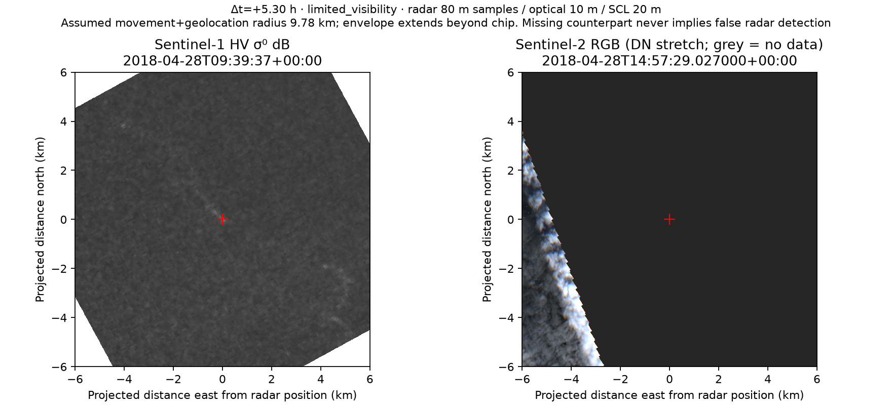

# Sentinel-2 ingestion and paired review, v1

Implemented 2026-10-05. This is an executable analyst workflow and a measured
availability pilot. It does not provide iceberg ground truth, precision, recall,
or a false-alarm estimate. Fresh Sentinel-1 SAFE deployment remains gated by
the [processing validation](../../processing-validation/v1/README.md).

## Measured availability

Live public Planetary Computer STAC searches cover all **25 evaluated development
SAR acquisitions**, intersecting the shared NL study polygon and a **±12-hour**
window. **15/25 (60%)** have overlapping Sentinel-2 L2A catalogue footprints;
**0/25** searches failed. This measures scene footprints, not candidate visibility.
The complete queries, times, returned items and unsigned asset URLs are in
[catalogue-coverage.json](catalogue-coverage.json).

| Selected development acquisition | Retained candidates inspected | Candidates with downloaded optical pixels in a review chip | Candidates passing the visibility screen |
|---|---:|---:|---:|
| 2018-03-31 21:23:55 UTC | 6 | 0 | 0 |
| 2018-04-28 09:39:37 UTC | 28 | 1 | 0 |
| Pilot total | 34 | 1 (2.94%) | 0 (0%) |

Receipts: [March pilot](pilot-march31.json) and [April pilot](pilot-april28.json).
All candidate catalogue searches succeeded, none of the final selected asset
reads failed, and no item-selection or candidate-selection truncation occurred.
March was already in the dashboard. April was subsequently selected from the
development cohort because its catalogue overlap could exercise the download
path. **This selection is biased and is not an estimate for the NL region or
the entire 311-candidate benchmark.** No held-out acquisition was opened.

The candidate at 52.058636°N, 53.644867°W has two genuine downloaded S2B tiles,
21UYT and 22UCC, acquired at 2018-04-28 14:57:29.027 UTC, **5.30 hours after SAR**.
Despite overlapping catalogue polygons, their native valid pixels cover only
about **7.2%** of the inspected disk and their screened visible fraction is
about **3.3%**. The candidate centre has no valid optical pixels. Both are
`limited_visibility`; neither supports absence or corroboration at that point.
The assumed movement/geolocation radius is **9.78 km**, larger than the **6 km**
chip radius. That limitation is shown explicitly.



[Example manifest](example-pair.json) records product IDs, source metadata,
acquisition times, local native crop hashes, source windows/grids, visibility,
alignment and generating-code hashes. Raw TIFFs stay in the ignored local data
directory. This example is Copernicus Sentinel data (2018), accessed through
Microsoft Planetary Computer; the radar derivative is from the AI4Arctic
ready-to-train dataset under its source terms. It is not a synthetic scene.

## Processing and matching contract

`cryolens.ingest.sentinel2` searches the public `sentinel-2-l2a` catalogue without
a scene-wide cloud cutoff, follows pagination, and rechecks geometry and UTC
time. A failed/incomplete catalogue request is distinct from no coverage.
For each candidate, up to three items intersecting the 6 km review box are
selected, prioritizing footprints covering its centre, then time proximity.
Selection truncation and individual asset failures are recorded. Tiles are
reviewed separately; no mosaicking or optical model is claimed.

Required native assets are **B02, B03, B04, B08 (10 m)** and **SCL (20 m)**.
Real COG range reads copy bounded source windows, preserving DN values, masks,
CRS and native grid without resampling. These are lossless native crops, not
downloads of entire Sentinel-2 products. Crop SHA256 checksums certify local
bytes, not publisher full-product integrity. Metadata includes unsigned source
URLs; expiring Azure signatures remain in memory and are not published.

Native SAR HH/HV pixels are copied from checksum-verified, frozen development
AI4Arctic inputs, using the publisher's normalization and geolocation tie points.
Unknown, changed and held-out sources are refused. Fresh SAFE candidates are
not released through this review producer while their scientific gate is closed.

For display, EPSG:3978 at 10 m uses nearest SAR dB values, bilinear optical DN,
nearest SCL and nearest source validity masks. The 80 m SAR samples and 20 m
quality information retain their original information content; display
resampling does not create finer measurements. The aligned optical GeoTIFF
also preserves the common RGB/SCL validity mask. Native files remain available.
The PNG uses a fixed DN stretch, **not quantitative surface reflectance**;
grey optical areas are missing data, not dark ocean.

The default search and screening policy is versioned in
[`configs/optical-review-v1.json`](../../../configs/optical-review-v1.json).
The possible displacement radius is:

```text
100 m SAR allowance + 20 m optical allowance
  + half the candidate's largest radar extent
  + 0.5 m/s × absolute acquisition time separation
```

These are explicit research presets, not measured geolocation errors, a C-CORE
protocol, or a validated movement limit. Vessels can move much faster; an
unexpected displacement requires ambiguity or an independently justified policy.
Radar extent is not physical iceberg size. The review radius is at least 1 km
and at most 6 km; larger assumed envelopes are flagged as incompletely inspected.
Changing assumptions creates new pair IDs and retains prior evidence.

Visibility is assessed over the inspected displacement disk intersected with
the NL polygon, including missing pixels in the denominator. SCL 0/1 and missing
RGB/SCL data are invalid. SCL 3/8/9/10 are cloud/shadow/cirrus with a 60 m circular
buffer; 2/7 are ambiguous. Classes 4/5/6/11 are potentially visible, with snow/ice
reported separately. `screened_useful` needs ≥80% screened visible coverage.
It is only screening **within the displayed region**, requires analyst inspection,
and cannot prove clear sky, full displacement coverage or object resolvability.
SCL categories and band resolutions follow the official
[Sentinel-2 processing documentation](https://sentiwiki.copernicus.eu/web/s2-processing)
and [product documentation](https://sentiwiki.copernicus.eu/web/s2-products).

## Analyst workflow

Choose a development acquisition, show unverified candidates, and open a
candidate. The inspector lists available pairs, their times, signed separation,
visibility fractions, movement allowance and incomplete-envelope warnings.
Open the PNG at full size and download the native bands/quality or aligned optical
GeoTIFF for QGIS inspection. NIR is supplied for analyst inspection; no
automatic optical iceberg classifier is implemented.

Configure `CRYOLENS_ANALYST_ID` and `CRYOLENS_ANALYST_API_KEY` locally in `.env`
and restart the API to enable evidence writes. The existing key field is used;
identity comes from the server. Without those values, the UI stays read-only.
No new satellite credentials are required for this public optical provider.

Record optical assessment and inspected visibility independently: corroborating,
ambiguous, unavailable, or no visible counterpart. Corroboration requires an
inspected clear view and an optical object position within the recorded
displacement envelope and chip, with verified valid optical pixels. Supply its
WGS84 coordinates from georeferenced imagery and explain source, position,
cloud/ice confusion, movement and resolution uncertainty in the evidence notes.
Missing imagery cannot be submitted as corroboration or no-visible-counterpart
evidence. A no-visible-counterpart observation **never automatically rejects or
reclassifies the radar candidate**. Evidence is authenticated and appended in a
separate history. There is no update/delete evidence endpoint.

The no-visible-counterpart category additionally requires screened useful
visibility and the entire assumed displacement envelope inside the chip; a
partial or obscured view must be recorded as ambiguity or unavailability.
Passing these checks still does not establish that a radar candidate is false.

No real analyst corroboration was entered during implementation. Automated
availability results are not manual labels. Authentication, append-only history,
invalid/masked position rejection, stale artifact refusal and preservation of the
radar verdict are verified by regression tests. Actual table/JSON/history queries
are checked with transaction-rolled-back fixtures against PostGIS.

## Reproduction

Run from the repository root with migrated PostGIS and the manifest-matched
native development NetCDFs in `data/raw/ai4arctic/`:

```text
uv run --frozen alembic upgrade head
uv run --frozen python -m cryolens.review --catalogue-evaluated
uv run --frozen python -m cryolens.review --scene-id <stored-development-scene-uuid> --limit 1000
```

If importing a previously evaluated development source into a fresh database:

```text
uv run --frozen python scripts/import_ai4arctic_scene.py --help
```

Use the existing import command's scene path and frozen development safeguards;
do not tune detection thresholds to obtain optical examples. This pilot imported
the already evaluated April source and reproduced its 28 retained candidates.
Database UUIDs are installation-specific. Published receipts retain the actual
local IDs; candidate availability denominators remain selected candidate counts.

An independent direct provider read compared **50 matched native pixels and
their validity masks** against the stored crops, across both tiles and all five
bands. All values and masks matched exactly; samples include valid nonzero
pixels and missing pixels. Locations, observed DN/mask values, unsigned source
URLs and crop hashes are recorded in
[native-pixel-check.json](native-pixel-check.json). This is sampled pixel
integrity evidence, not a whole-product checksum or target confirmation.

Artifacts and `candidate-coverage.json` are written under
`data/processed/optical-review/`; copy per-run reports before another pilot run.
Pair IDs bind candidate, radar provenance, selected optical item, policy,
generating-code checksums and AOI. Existing artifacts are hash-verified before
reuse and serving. A rerun records its new search, while cached pair manifests
keep the original generation/search receipt. Raw data remain outside Git.

The remaining scientific work is broader representative availability sampling,
human corroboration/ambiguity review, independent matched target truth and the
separate fresh-SAFE processing release. The Sentinel-2 workflow does not solve
those by treating silence as a negative label.
