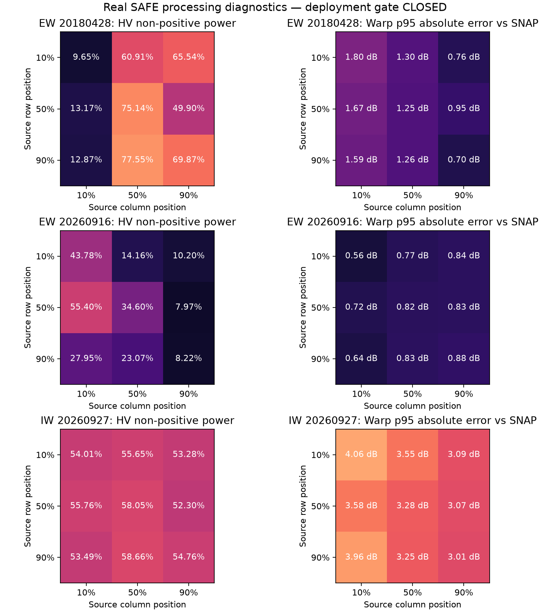

# Real Sentinel-1 processing validation v1

**Fresh SAFE deployment gate: CLOSED.** No tested product passes the combined
radiometric usability and scientific comparison gate. This work implements the
investigation, IW reader support, rejection handling and reproducible checks;
it does not complete roadmap step 2's acceptance condition.

## Inputs and sampling

Three authentic CDSE COG SAFE products are development inputs:

| Product | Acquisition UTC | Mode and polarizations | Role |
|---|---|---|---|
| Sentinel-1B | 2018-04-28 09:39:37 | EW GRDM HH/HV | Same acquisition as an AI4Arctic scene; legacy IPF 2.90 |
| Sentinel-1C | 2026-09-16 21:24:42 | EW GRDM HH/HV | Fresh Labrador acquisition; IPF 4.03 |
| Sentinel-1C | 2026-09-27 09:33:34 | IW GRDH HH/HV | Southern NL study waters; IPF 4.03 |

Full product identifiers, source measurement and annotation hashes are in
[report.json](report.json). The new IW ZIP has official-catalogue-matched size
and MD5, a passing ZIP CRC and recorded SHA256 in
[iw-integrity.json](iw-integrity.json). It is an additional development input,
excluded from the frozen evaluation cohort. The reserved test acquisitions
were not inspected; the validator refuses their acquisition IDs.

Every measurement pixel is scanned in bounded 256-row stripes. Spatial
comparisons use nine systematic 512×512 windows per product: source row and
column positions at 10%, 50% and 90%. These windows diagnose processing, not
target-detection performance. Full-footprint negative fractions include land
and water outside the study polygon; they are not eligible-area or false-alarm
statistics. IW is evaluated here in HH/HV only; VV/VH is never relabelled.

## Independent processing and provenance

The independent reference is the actual ESA SNAP 14.0.0 executable, using
[the versioned graph](../../../configs/snap/validation-reference.xml).
The official installer SHA256 is
`786ce26a464ce32aef133af25b81281ad1b0af320e3614c0b465939fffbb4ee6`.
Its [publisher checksum list](https://step.esa.int/downloads/14.0/installers/sha256sums)
was checked before installation into an isolated container. The measured
container image ID is recorded in the report. Rebuild recipes pin the SNAP
installer and NERSC source commit; Ubuntu package versions are not fully locked,
so rebuilt image IDs may differ and must be recorded again.

The graph compares raw calibration and signed thermal-noise correction in
sensor coordinates, then uses Ellipsoid-Correction-RD on **uncorrected**
calibrated power to isolate geocoding from noise removal. Geometry uses the
annotated orbit and scene-height convention, EPSG:3978, 40 m output spacing and
bilinear resampling, without precise-orbit application or terrain normalization.
40 m pixel spacing does not establish 40 m sensor resolution.

COG SAFE provenance has an important trap: the first software record can be
COGifier 1.00 rather than the original Sentinel-1 IPF. The reference scratch
view selects the existing GRD Post Processing record instead of its outer COG
Conversion wrapper. Measurements are losslessly rewritten with DEFLATE for
reader compatibility, and decoded block hashes must agree exactly. Source
archives stay unchanged. Original and scratch manifest hashes, annotation
hashes and measurement hashes are recorded. **The adapted scratch view is not
an authenticated original SAFE archive.** Reference-cache receipts bind the
scratch inputs, graph, runtime, window and output hashes; stale caches fail.

## Findings and acceptance limits

The report contains matched counts, signed residual agreement, per-window
errors, stripe profiles, rejection reasons and COG validation results. The
engineering limits are deliberately conservative project presets, not ESA,
C-CORE or navigational standards:

- At most 5% non-positive corrected power and at least 10% finite measurement
  coverage per channel; actual annotations must supply plausible incidence
  angles (15–50°) and paired geolocation within 20 m.
- Calibration/noise p95 absolute error ≤0.02 dB on at least 4,096 positive
  matched pixels; residual sign mismatch ≤0.0001 of finite matched pixels.
- Annotation-coordinate discrepancy ≤20 m and incidence discrepancy ≤0.05°.
- Relative texture displacement ≤40 m and warped-radiometry p95 absolute error
  ≤1 dB on at least 4,096 matched pixels, excluding two output edge pixels.
- Valid four-band COG, common nodata mask, physical incidence and consistent
  HH-minus-HV ratio. Empty observations and empty comparisons fail.

Two reader bugs were reproduced and fixed: range-noise vectors need selection
within the annotated azimuth block, with edge extrapolation; azimuth LUTs also
need linear extrapolation when the last knot precedes the block's declared end.
Calibration and signed noise comparisons now agree closely with SNAP across
the sampled source pixels. This does **not** establish usable corrected power:
the full-scene HV non-positive fractions remain approximately **45.7%** (old
EW), **26.1%** (fresh EW) and **54.3%** (IW). All three products are rejected.
Non-positive residuals can reflect noise-limited returns or noise-model error;
they do not by themselves prove that ESA subtracted valid target signal.

The fresh EW windows pass the tested geometric/radiometric comparisons. Legacy
EW and IW still have unacceptable relative spatial or resampled-radiometry
errors. Common annotation agreement is not an independent survey of absolute
ground accuracy. The geometry experiment uses cropped source grids; it does
not certify whole-product geocoding.



The published [NERSC implementation](https://github.com/nansencenter/sentinel1denoised)
was also executed at commit `8259f0560b79c49177d865ba10d213c0ce25fe7c`
on the Sentinel-1B product. Its default negative-gap filling initially hid the
problem. With `remove_negative=False`, no angular correction and the actual
named IPF version, **59.6%** of HV pixels remained non-positive. See
[the measured result](nersc-signed-power.json). It was not adopted. This one
test does not establish that NERSC denoising fails generally, and does not
qualify its coefficients for Sentinel-1C/D.

## Pipeline behaviour

Preprocessing scans real observations before allocating full scenes. Failures
write `processing-quality.json` and stop export. Signed negative residuals
remain measurable; they are not converted into plausible decibels. Warping
averages linear power before logarithms, retains invalid-source support, and
derives the polarimetric ratio after resampling. Diagnostic COGs deliberately
carry rejection provenance and cannot enter detection.

Both the detection CLI and pipeline require a passed product-quality receipt
and a separately released fresh-detection gate. No current producer grants
that second gate. The legacy SNAP production graph is not the validated
reference recipe or a released operational path; its runner also performs the
quality preflight. Existing AI4Arctic processing and experiments remain
available through their separate documented data contract.

## Reproduce

Obtain the exact three products listed in
[the configuration](../../../configs/sentinel1-validation-v1.json) from CDSE
using local credentials, without adding them to Git. Build the external
runtimes from the repository root:

```text
docker build -f validation/Dockerfile.snap14 -t cryolens-snap-reference:14.0.0 .
docker build -f validation/Dockerfile.nersc -t cryolens-nersc-reference:8259f056 .
python -m cryolens.preprocess.validation --output-dir data/processed/safe-validation-v1/final --scratch-dir data/interim/safe-validation-setup/snap-input --run-reference
```

The validator returns a non-zero exit code when the deployment gate fails,
while retaining JSON reports, reference receipts, logs and diagnostic COGs.
Rerun without `--run-reference` only with verified cached reference outputs.
Add `--reuse-full-scan` only to reuse a previous full measurement scan whose
input provenance, reader and quality-code hashes still match. A skipped scan
cannot open the gate. The retained report records the reused report's digest.
To evaluate the advanced algorithm with the repository's actual external
runner, mount the original SAFE parent as `/input:ro`, an empty result directory
as `/output`, and `validation` as `/validation:ro`, then invoke:

```text
docker run --rm -v <SAFE-parent>:/input:ro -v <results>:/output -v <repository>/validation:/validation:ro cryolens-nersc-reference:8259f056 /validation/run_nersc.py /input/<S1B-product>.SAFE /output
python validation/publish_report.py --report data/processed/safe-validation-v1/final/report.json --iw-receipt data/interim/safe-validation-setup/iw-receipt.json --nersc-report data/processed/safe-validation-v1/nersc-report.json --output-dir docs/processing-validation/v1
python validation/track_report.py --report-dir docs/processing-validation/v1 --tracking-uri sqlite:///data/processed/mlflow.db
```

The MLflow run is a post-hoc record of this processing investigation, bound to
the frozen scope, actual product hashes, report, configuration, Git commit and
code snapshot. It makes no model-performance claim and reads no test SAR data.

Resolve the remaining geometry discrepancy against the documented range-Doppler
reference, qualify a radiometrically defensible noise workflow, and validate
additional representative acquisitions before opening deployment. Do not
loosen thresholds, fill negative gaps or hardcode spatial offsets to manufacture
a pass. Neither southern NL operational coverage nor detector precision/recall
is established by these processing experiments.
